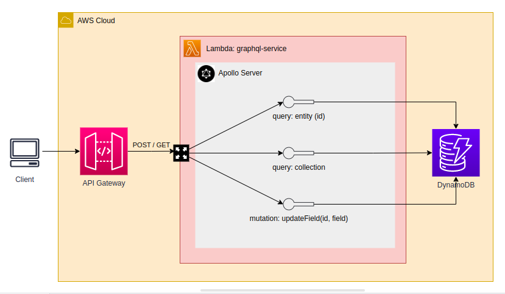
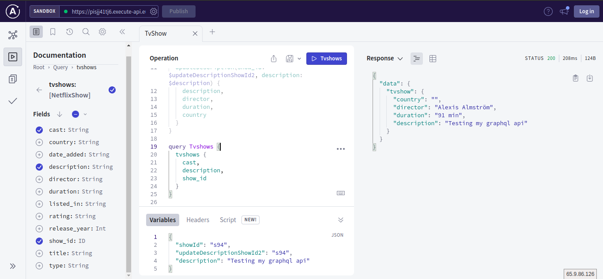

# API Gateway - Geo Location Dashboard

### Project Overview
This project is a GraphQL API demo running on top of an AWS Serverless architecture, deployed using CDK.
This API is supposed to query Netflix TV Shows from a database.

GraphQL client view:

##### ___Schema___
__query__:
* tvshow (id) => Returns one entity
* tvshows => Returns all TV Shows as a collections

__mutations__: 
* udpateDescription(id, description) => Updates a TV Show entity description

#### AWS Services used:
- [API Gateway] - API service.
- [Lambda] - FAAS (Function as a service).
- [DynamoDB] - TV Shows catalog storage.

_More about GraphQL: https://graphql.org/learn/_

## _Commands to deploy_

* `npm run package`                         compile typescript to js
* `cdk deploy --profile <aws_profile>`      deploy this stack to your default AWS account/region
* `cdk diff --profile <aws_profile>`        compare deployed stack with current state
* `cdk synth --profile <aws_profile>`       emits the synthesized CloudFormation template